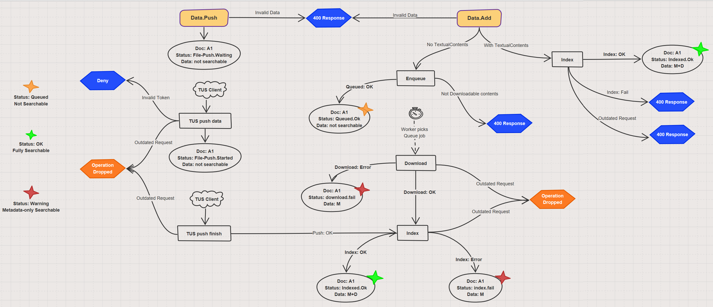

# Framework Architecture

> **note**:
> This section is currently being written, the documentation may not be complete

The K-Search API has been build on Symfony v4.x, it adheres to the [Symfony Coding Standards](https://symfony.com/doc/current/contributing/code/standards.html)
and follows the Symfony implementation guidelines.

[Symfony Flex](https://symfony.com/doc/current/setup/flex.html) has been enabled to manage the K-Search API.

## Data processing

The Data processing follows the workflow described in the following image:

The K-Search system makes use of a processing queue to download and index Data for which the textual contents
are not provided during the `data.add` API invocation.

A Data item is recorded as to be processed by one of the K-Search workers that runs by the `enqueue:consume` command.
The command is responsible to handle the messages in the queue, invoke the corresponding worker that will download the
required Data's file and trigger the indexing.
If a failure is received during any of those phases, the error is reported and accessible by the `data.status` API.

The queuing and processing of Data adding ensures that newer requests take the precedence when competing on the indexing
this ensures that an older data processing item in the queue, will not overwrite a newer Data in the index.

As the adding of Data into the index is done in two separated stages, the system differentiates between the status of
Data being in the index (thus searchable) and Data being in the processing queue.
For more details about the `data.status` API, refer to the online documentation.

## Directory Structure

### Var folder
The `var/` folder contains the project related files used during the K-Search run, in particular:

- `var/log`: the system logs
- `var/cache`: the symfony cache files
- `var/data-downloads`: files downloaded before the indexing of a Data.
    Files are grouped together in folders by the first 2 characters of the Data UUID identifier.
- `var/data.db`: contains the SQLite Database file for the Data processing list queue
